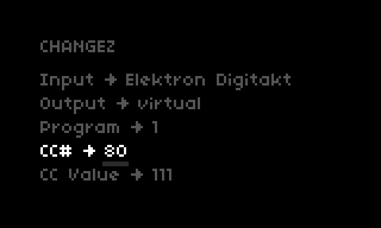

# changez

It's not just the French formal imperitive conjugation of the verb "to change." It's a norns mod that eats `program change` messages from one midi device and spits `cc` messages out to another.

Midi devices are selected from the changez mod menu (`SYSTEM > MODS > CHANGEZ>`). These devices will need to be different from any you are using with whichever scripts you run.

The mod menu is also where you'll program your continuous controller messages. Each of the standard midi programs can emit any and all of the control channels comprising them.

Because programming all of those programs can be tedious, the mod is equipped with `autosave` upon backing out of the mod menu (`K2`). This only saves the program data you have set. Upon restarting the norns you'll need to select your devices again.

Because everyone deserves a fresh start now and again, you can can trash your autosave and start from scratch on the whole config by navigating to the mod params (`EDIT > CHANGEZ`) and toggling `Reset Programs`.

CAVEATS: This menu doesn't exist without a script loaded, and there is __no undo for resets__.

Autosave is handled via `dust/data/changez.autosave`. Renaming is a safer alternative to resetting.

Last, maybe best, thing: parameter map routing is enabled by default here in the params. Toggle it off if you prefer.

Pick a controller. Pick a channel. Pick a device (I've only tried it with `virtual`). 

Then set up some programs.

To switch between.

That's it.